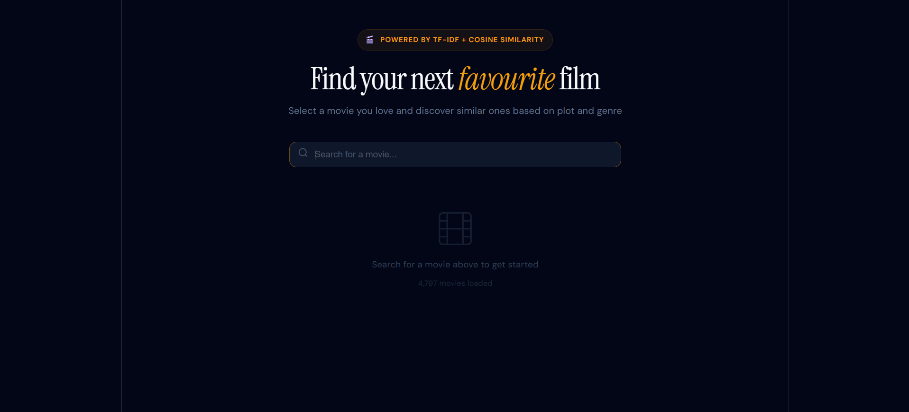

# 🎬 Movie Recommender

A content-based movie recommendation system that suggests similar films based on plot and genre. Built with a FastAPI backend and a React frontend.



---

## How it works

1. Movie plots and genres from the dataset are combined and cleaned (lowercasing, stop word removal, lemmatisation)
2. A TF-IDF matrix is built from the cleaned text, with genre tokens weighted for extra influence
3. Cosine similarity scores are calculated between all movie pairs and saved to disk
4. The FastAPI backend loads these scores and serves recommendations via a REST API
5. The React frontend lets you search for a movie and displays the top N most similar results with posters and plot summaries fetched from the OMDB API

---

## Tech stack

| Layer | Technology |
|---|---|
| Data processing | Python, pandas, scikit-learn, NLTK |
| Backend | FastAPI, Uvicorn |
| Poster/plot enrichment | OMDB API |
| Frontend | React, Vite |

---

## Project structure

```
movie-recommender/
├── backend/
│   ├── api.py                  # FastAPI app — serves /movies and /recommend
│   ├── preprocess.py           # Cleans data and generates similarity matrix
│   ├── recommend.py            # Core recommendation logic
│   ├── omdb_utils.py           # OMDB API helper
│   ├── config.example.json     # Copy to config.json and add your API key
│   ├── requirements.txt
│   └── data/
│       └── movies.csv
└── frontend/
    └── src/
        ├── App.jsx
        └── MovieRecommender.jsx
```

---

## Getting started

### Prerequisites

- Python 3.9+
- Node.js 18+
- An OMDB API key — get one free at [omdbapi.com](https://www.omdbapi.com/apikey.aspx)

### 1. Clone the repository

```bash
git clone https://github.com/your-username/movie-recommender.git
cd movie-recommender
```

### 2. Backend setup

```bash
cd backend
pip install -r requirements.txt
```

Copy the example config and add your OMDB API key:
```bash
cp config.example.json config.json
# then open config.json and paste your key
```

Place your `movies.csv` inside `backend/data/`. The CSV must have at minimum these columns:

| Column | Description |
|---|---|
| `title` | Movie title |
| `overview` | Plot summary |
| `genres` | Genre string or JSON list |

Run preprocessing to generate the similarity matrix (only needs to be done once, or when the dataset changes):
```bash
python preprocess.py
```

Start the API server:
```bash
uvicorn api:app --reload --port 8000
```

### 3. Frontend setup

```bash
cd ../frontend
npm install
npm run dev
```

Open [http://localhost:5173](http://localhost:5173) in your browser.

---

## API endpoints

| Method | Endpoint | Description |
|---|---|---|
| GET | `/movies` | Returns all movie titles for the search box |
| GET | `/recommend?movie=Inception&top_n=5` | Returns top N similar movies |
| GET | `/health` | Server health check |

---

## Dataset

This project was built using the [TMDB 5000 Movie Dataset](https://www.kaggle.com/datasets/tmdb/tmdb-movie-metadata) from Kaggle.

---

## Roadmap

- [ ] TV series recommendations
- [ ] Indian regional language movies (Tamil, Telugu, Malayalam, Kannada)
- [ ] TMDb API integration for richer metadata
- [ ] User ratings and collaborative filtering

---

## License

MIT
